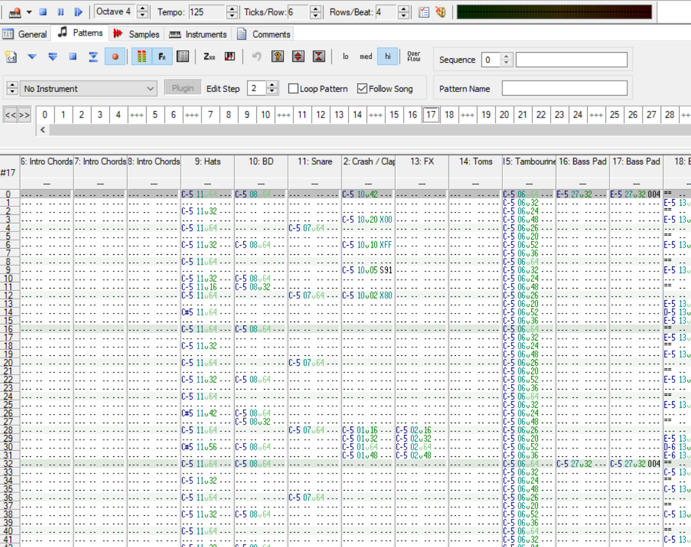
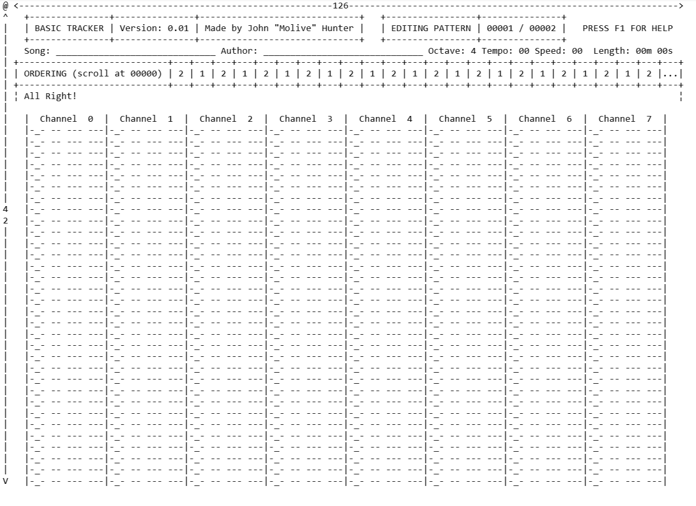

# Write up
## Introduction
_Hello!_

Welcome to the write up for up Basic Tracker, a chiptune music tracker written in C#. It was specifically written not to a client's needs but rather mainly to see if I could make a "tracker" using only text based rendering, which I have mostly achieved.\footnote{It is simple design wise to make the windows forms sections into console sections, I just don't have time. This would also increase platform portability.} It is also to fill a mild gap in the market of a "SNES Tracker", that is music software for creating music that can be played back on the [Super Nintendo Entertainment System][snes].

## What is a tracker?
A music tracker is a piece of software which allows people to write music using a column based command interface. As opposed to modern programs, which use a piano roll style editing interface where notes are written from left to right as rectangles, a tracker has a grid in which commands to start, stop and edit notes are placed.  

The first tracker was the "Ultimate Soundtracker"\footnote{Ultimate being a misnomer here, as there was a lot to improve on.}, which was a music creation software for the Amiga line of home computers. As with other trackers, it features a series of columns, representing the channels that the Amiga could play sound on. As the song played back, a cursor moves across the screen executing the instructions in the grid as it hits them.  
Shortly after there was the release of possibly the most famous tracker, Protracker, which built off of the code of the original to add more features and to fix various bugs.

Trackers are generally aimed at computer literate people as they have a system of writing music that isn't immediately obvious. As such, I have consulted with Demosceners who use other trackers regularly in their spare time on what Basic Tracker should have and how to improve it. They are also my target audience.

## How does Basic Tracker work internally?
Basic tracker is split into three static classes\footnote{Not including the Program class that holds it all together}: ConsoleX, Driver, and AudioSubsystem. Each one class treats the other two almost like a black box, and only react to the others specifically sending them commands. For example, the Driver isn't allowed to see what the user is typing or looking at, and the AudioSubsystem is not allowed to see what the song data looks like. Due to these limits the three systems can be run entirely out of step with each other, with the three systems dealing with the other's requests at their own pace.  
Using this method also means that each section is not entirely dependant on the others. If you wish to only have a version that played back files, rather than also editing them, you can trivially remove the ConsoleX class from the project and you should have a version where only the playback sections exist. If you wanted to create a version where the driver interpreted the song differently, for example, then as long as it produced mainly the same functions you could entirely swap out the Driver to something else and it should still playback. If you wanted to do something entirely different but still using the simulated hardware that Basic Tracker creates then both ConsoleX and Driver should be able to be removed without the AudioSubsystem throwing many, if any errors.

The program follows the following diagram in how the data is passed around internally:

\dotfile internalstructure.gv "The internal structure of Basic Tracker"

The user provides input in the form of keypresses to the ConsoleX class. ConsoleX then takes these keypresses, and if it determines that the song needs to be edited or that the Driver should start running, it calls a function in the Driver. It also produces a graphical interface to inform the user of what has been happening.  
The Driver class takes the song and interprets it in realtime to turn the notes in the tracker format to a list of note instructions which it sends in realtime to the AudioSubsystem. The instructions sent to the AudioSubsystem include things like set pitch or volume, or start or stop playing. Effects like vibrato are turned into many pitch sets.\footnote{You'll notice in the diagram that there is a greyed out line from the Driver back to ConsoleX. This is because there is some functions in the Driver that reference it, even though they probably don't need to.This also breaks the ability to entirely remove ConsoleX, but it shouldn't be too hard to fix it so that Driver does not reference ConsoleX.}  
The AudioSubsystem is then run forever in a loop without ever consulting the other two sections. It takes note of what the Driver tells it, and stores that into variables. It then is called by the Windows API to produce sound for a certain length of time, and so it takes whatever the variables happen to be at that time and produces sound based entirely on that. By streaming note updates to the AudioSubsystem from the Driver Basic Tracker can create music.  
Because of this disconnected nature of the project, if one section suddenly fails higher in the chain the ones below it should keep working. A good example of this is how the Run One Row feature works, as the row is only executed for the length of the row but the AudioSubsystem keeps outputting music forever (or until it gets annoying and you press tab). 


## Design
My tracker is influenced by three main sources.
### GUI
For the GUI and user facing side it is mainly based on my own experience using the Windows tracker program Open ModPlug Tracker (OpenMPT), shown in the below image.



A lot of the features that you can see in the final design of Basic Tracker are shown in this screen shot, for example the column for each channel and the respective headings, the row numbering on the left, the ordering row, the octave, tempo, and ticks counter at the very top, and so on.  
There are a few differences in this compared to Basic Tracker, notably the more than 8 channels and the more than 32 rows. OpenMPT is much more forward thinking than Basic Tracker in that it can open many file formats from the past, and so can support loading files with many more that 8 channels. Basic Tracker is designed to only run at 8 channels and 32 rows, as that makes the code simpler and it makes the screen design easier.  
In this and most other trackers the pattern moves under the cursor. This is mainly so you can fit more than 32 rows on screen, but as I move the cursor under the row I am limited to the user's screen size.

Here is a design stage drawing of the screen.



As you can see this is very close to the final version, but a few changes were made, notably the replacement of the mostly useless length of the song with the instrument selector and the placement of the row numbers to the left of the columns. The entire tracker was also going to be black and white for a lot of development, and the colours were added halfway through after switching to the low level console drawing method which made them possible.

### File Format and features
The file format was one of the first things to be created, and is based heavily on the file format for Impulse Tracker files. This was done because Impulse Tracker is a well used and stable tracker and therefore the file format is very suitable for compressing and storing the data for a song in very small amounts. I do not think I have seen a Basic Tracker file pass a few kilobytes in size.

\pagebreak

The design stage for the file format is as follows:

**Header Data**  
|     | 0 | 1 | 2 | 3 | 4 | 5 | 6 | 7 | 8 | 9 | A | B | C | D | E | F |
|:-----:|:---:|:---:|:---:|:---:|:---:|:---:|:---:|:---:|:---:|:---:|:---:|:---:|:---:|:---:|:---:|:---:|
|0000 |'B'|'S'|'C'|'M'| Song Name, max 30 characters, NULL is underscore   ||||||||||||
|0010 | Song Name continued... ||||||||||||||||
|0020 |Song N.|| Author Name, max 30 characters, NULL is underscore ||||||||||||||
|0030 |Author Name continued||||||||||||||||
|0040 |OrdNum ||PatNum || Cwt/v || Cmwt  ||      Reserved     ||||||IS |IT|
|0050 | Orders, Length = OrdNum                                       ||||||||||||||||
|xxxx | 'Long' Offset of patterns, Length = PatNum*4 (offset 1)       ||||||||||||||||

```
(offset 1) = 0050h+OrdNum

      Cwt:      Created with tracker.
                 Basic Tracker y.xx = 1yxxh
      Cmwt:     Compatible with tracker with version greater than value.
                 (ie. format version) (not checked)
      OrdNum:   Number of orders in song.
      PatNum:   Number of patterns in song
      
      Res.: Reserved, unused
      IS:       Initial Speed of song.
      IT:       Initial Tempo of song
      Orders:   This is the order in which the patterns are played.
                 Valid values are from 0->65530.
                 65534 = "---", End of song marker
                 65535 = "+++", Skip to next order
```
Pattern data
|     | 0 | 1 | 2 | 3 | 4 | 5 | 6 | 7 | 8 | 9 | A | B | C | D | E | F |
|:-----:|:---:|:---:|:---:|:---:|:---:|:---:|:---:|:---:|:---:|:---:|:---:|:---:|:---:|:---:|:---:|:---:|
|0000 |Length || Packed data................                           ||||||||||||||
```
Length:   Length of packed pattern, not including the 2 byte header
                Note that the pattern + the 2 byte header will ALWAYS
                be less than 64k
                
Patterns are unpacked by the following pseudocode:
Assume previous values only exist for the pattern they are in.

For each row:
GetNextChannelMarker:
        Read byte into channelvariable.
        if(channelvariable = 0) then end of row
        Channel = (channelvariable-1) & 7              ; Channel is 0 based.
        if(channelvariable & 128) then read byte into maskvariable
          else maskvariable = previousmaskvariable for current channel
if(maskvariable & 1), then read note. (byte value)
                // Note ranges from 0->119 (C-0 -> B-9)
                // 255 = note off, 254 = notecut
                // Others = note fade (already programmed into IT's player
                //                     but not available in the editor)
if(maskvariable & 2), then read instrument (byte value)
                // Instrument ranges from 1->99
if(maskvariable & 4), then read volume/panning (byte value)
                // Volume ranges from 0->64
                // Panning ranges from 0->64, mapped onto 128->192
                // Prepare for the following also:
                //  65->74 = Fine volume up
                //  75->84 = Fine volume down
                //  85->94 = Volume slide up
                //  95->104 = Volume slide down
                //  105->114 = Pitch Slide down
                //  115->124 = Pitch Slide up
                //  193->202 = Portamento to
                //  203->212 = Vibrato
Effects 65 is equivalent to D0F, 66 is equivalent to D1F -> 74 = D9F
        Similarly for 75-84 (DFx), 85-94 (Dx0), 95->104 (D0x).
(Fine) Volume up/down all share the same memory (NOT shared with Dxx
        in the effect column tho).
Pitch slide up/down affect E/F/(G)'s memory - a Pitch slide
        up/down of x is equivalent to a normal slide by x*4
Portamento to (Gx) affects the memory for Gxx and has the equivalent
        slide given by this table:
SlideTable      DB      1, 4, 8, 16, 32, 64, 96, 128, 255
Vibrato uses the same 'memory' as Hxx/Uxx.
if(maskvariable & 8), then read command (byte value) and commandvalue
                // Valid ranges from 0->37 (0=no effect, 1=A, 2=B, 3=C, etc.)
if(maskvariable & 16), then note = lastnote for channel
        if(maskvariable & 32), then instrument = lastinstrument for channel
        if(maskvariable & 64), then volume/pan = lastvolume/pan for channel
        if(maskvariable & 128), then {
                command = lastcommand for channel and
                commandvalue = lastcommandvalue for channel
        }
        Goto GetNextChannelMarker
```
The file is a binary file.

The header is at the start of the file, and defines several global things such as the author and title. It also contains the letters "BSCM", which denotes that this is a Basic Tracker file. If these letters are not found, the file will not be opened.  
The main sections that follow one after the other are the patterns. They can be found by reading the pattern pointers in the header and by reading the length at the start, or they can be found by simply abusing the fact that each one is in order and follows on immediately from the last.  
The pattern sections are designed to have a form of RLE (run length encoding) built into them, where if a note, instrument, volume or effect in a channel is the same as the previous note in that channel a flag is set instead of repeating the information. This saves one byte per note encoded for the note, instrument, and volume and two bytes per note for the effect. If a note is entirely identical to the one above it, it is encoded in only one byte, but one that is entirely different takes six.  
There is also optimizations in that if a channel is empty for any given row it is skipped in the file, and as such a row that is empty has no channels which saves further bytes. Altogther the result is a file that is significantly smaller than without the optimisations.\footnote{Although this was probably much more important back in the 90s than it is now.}

There is a bug in the saving/loading of files where a note that has no volume will be assigned one at full volume, which ruins songs. This is being looked into.

As part of the file structure you'll see a section that is the current version and the versions that this file can be supported by. This is to make sure versions of the program will support files into the future. It is not currently implemented, but the way this would work is that the program has a list of versions that it will open, up to the version that it is. The program checks the creation version on load, and if that version is not in that list it doesn't load. This works for versions that are less than the current version (as otherwise they would be in the list) but for versions higher than the current one (future releases) the program cannot know if it is able to load the file. The simple thing to do would be to ignore the file completely, but there is a second parameter in the file which is the earliest version that can load it. If the version of basictracker is after this value, even if the tracker cannot tell, the file seems to think the tracker can load it and so it can try and load. For all other cases the file should be ignored to stop corruption of files.

### Hardware mockup
Basic Tracker is designed to be an old-school tracker reminicent of the ones from the 90s. As such, it attempts to emulate a hardware system that the software would be running on. The system that it tries to emulate is the [SNES].  
The SNES features 8 channels of sound that can be any waveform, but Basic Tracker is limited to only simple waves\footnote{I was not quite sure how to implement a sample editor only in text mode.}. It also features ADSR envelopes that are not implemented\footnote{Same reason as above.}. Mainly it supports the noise effect that is built into hardware (rather than being a sample) and the FM effect, that allows for very complicated effects. The audio system is also designed in a way such that the driver does most of the heavy lifting, so complicated effects are run in software rather than hardware. It is in this way that theoretically, any Basic Tracker file should playback on a SNES.  
Most of this work was done in my own experience of a lack of SNES based music software (or at least ones that perform all features). Two other features that I would like to add would be filter effects using the Zxx macro and the ability to use the hardware echo that the SNES supports. Unfortunately, the implementation of the echo eluded me and it was never coded.  In order to create a feature complete tracker however the ASDR and sample editing would have to be added, which is much beyond my coding ability.  


## User Feedback

> **Molive**  13:56  
> Hey guys, for my A-level project I've created a tracker entirely in C# and the windows console. Apparently I need an end-user to test it and to give me feedback so I can write about it in a report
> 
> **ruairi**  13:56  
> shit that's awesome
> 
> **Molive**  13:56  
> I'd be great if someone could test it and tell me what could be improved and stuff  
> 13:56  
> https://1drv.ms/u/s!******************************
> 13:57  
> Thanks!
> 
> **ruairi**  14:08  
> I've had a brief play, it's pretty solid  
> 14:09  
> wouldn't mind a page up / page down and tab to next column but I appreciate it's a proof of concept
> 
> **Molive**  14:09  
> F1 has all the keys in a huge block of text  
> 14:09  
> holding ctrl moves per column  
> 14:10  
> I think I need to rewrite that help menu actually, haha
> 
> **Mantratronic**  14:11  
> will give it a go, but next time that i can do it properly will be tomorrow afternoon  
> 14:11  
> also what @ruairi said!
> 
> **ruairi**  14:12  
> @Molive A beautiful guide in Markdown would be appreciated ;)
> 
> **Hoffman**  14:12  
> ouch  
> 14:12  
> _(image of the old help menu)_
> 
> 14:13  
> a markdown page would be nice, but also maybe incorporating the the help as pages inside the console window?
> 
> **d0pefish**  14:14  
> ```csharp
> MessageBox.Show("
> Lorem Ipsum is simply dummy text of the printing and typesetting industry. Lorem Ipsum has been the industry's standard dummy text ever since the 1500s, when an unknown printer took a galley of type and scrambled it to make a type specimen book. It has survived not only five centuries, but also the leap into electronic typesetting, remaining essentially unchanged. It was popularised in the 1960s with the release of Letraset sheets containing Lorem Ipsum passages, and more recently with desktop publishing software like Aldus PageMaker including versions of Lorem Ipsum.
> ");
> ``` 
> (edited)
> 
> **Bossman**  14:23  
> @Molive would love to take a look, but that link is broken for me  
> 14:23    
> oh wait... turns off VPN  
> 14:26  
> All the ASIOs  
> _(screen showing Bossman's 16 install ASIO drivers, from the first screen in the program)_
> 
> **Bossman**  14:29  
> Between VPN fail, Chrome telling me not to trust "not commonly downloaded" files and Windows Defender, it was a battle to run this thing  
> 14:29  
> but once up, seems solid  
> 14:30  
> Good work @Molive
> 
> **ruairi**  14:34  
> lol two words of feedback @Bossman :D
> 
> **Molive**  14:34  
> Thanks!
> 
> **Bossman**  14:35  
> @ruairi I'm working. Proper analysis later  
> 14:35  
> Wanted to grab the download before I forgot
> 
> **df0**  16:41  
> certainly is the biggest tracker @ 151MB!
> 
> **df0**  16:41  
> _(Deltafire's computer has thrown a message because my program could contain a virus)_
> 
> 16:42  
> it really doesn't want to run it!  
> _(Windows smartscreen has also triggered on the program)_
> 
> 16:45  
> tab and shift-tab to move between tracks would be cool  
> 16:45  
> i know ctrl does it, but i suspect most people expect tab to  
> 16:46  
> menus would be super-cool!
> 
> **Hoffman**  17:03  
> a page showing what all the commands are would be REALLY helpful
> 
> **LiSU**  21:09  
> an option to export as a pokey\footnote{"POKEY" was the name of the sound chip from the Atari 8-bit range of home computers. It also controlled things like the keyboard.} tune would be even cooler! (I'm suffering from the lack of pokey trackers)
> 
> **Molive**  23:53  
> It's kinda designed with the SNES in mind, you should be able to export it directly to SNES  
> 23:54  
> I might be able to add other converters but that's outside my A-level. A summer project maybe?  
> 
> **Molive** 23:55  
> > replied to certainly is the biggest tracker @ 151MB!  
>  
> It, uh, kinda contains the entire net runtime :D

[snes]: https://www.wikipedia.org/wiki/snes